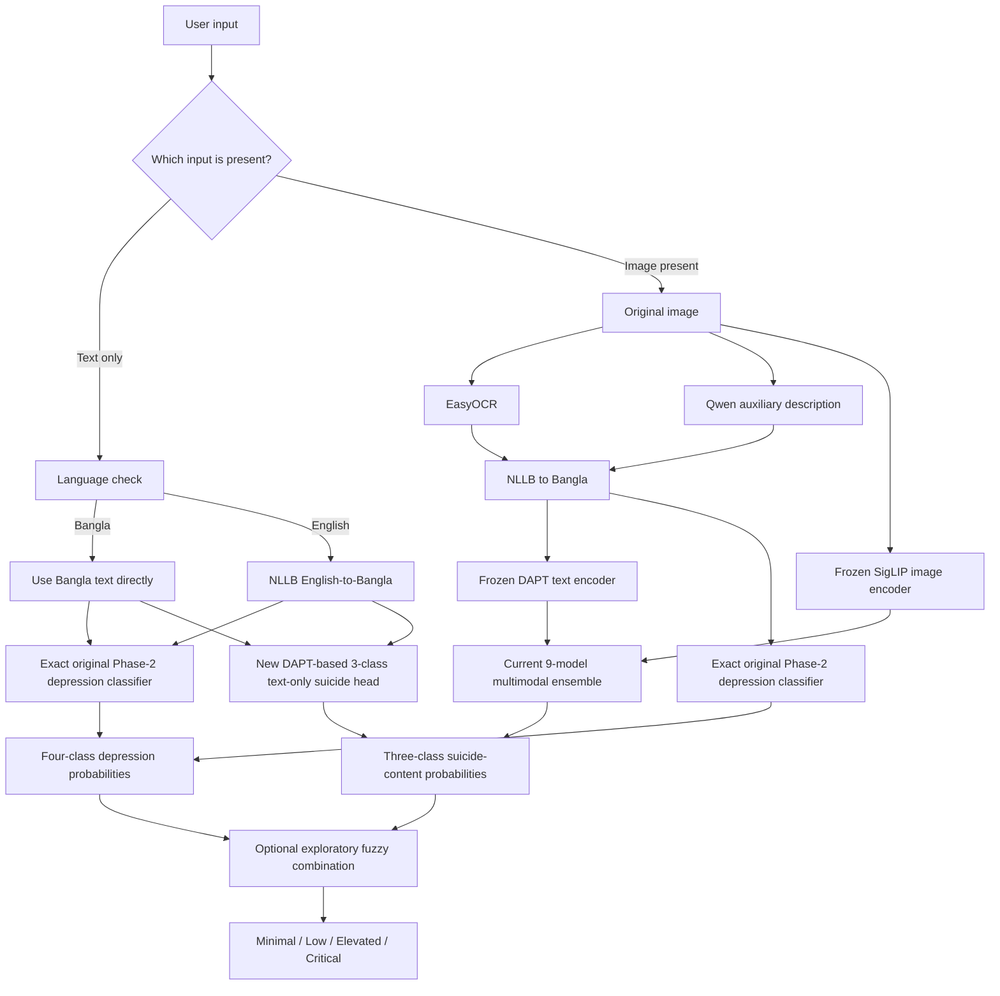

# Claude Handoff: Preserve the Bangla DAPT Model and Complete the Modality-Aware Multimodal System

## 1. Purpose of this document

This document is a self-contained technical and research handoff for Claude. It explains:

- what the thesis has already completed;
- what the current multimodal system actually does;
- which experiments succeeded or failed;
- which claims are scientifically safe to make;
- the remaining problem with text-only and image-only inputs;
- the recommended modality-aware extension;
- how to preserve the exact output of the best Phase-2 DAPT depression model;
- what Claude should inspect and implement next.

Do not redesign the entire project before reading this document. The recommended short-term goal is to preserve the successful existing work and add missing-input support around it. A complete replacement with a large vision-language model is not recommended under the current small-data and short-deadline conditions.

---

## 2. Research objective

The thesis investigates low-resource Bangla mental-health and suicide-related content analysis.

The work has two related but different prediction tasks:

1. **Bangla depression-severity classification**
   - Input: Bangla text.
   - Output: `Minimum`, `Mild`, `Moderate`, or `Severe`.
   - This is the original Phase-2 task.

2. **Multimodal suicide-content severity classification**
   - Input: a Reddit meme image and text derived from that image.
   - Output: a harmonized three-class suicide-content label.
   - This is the newer multimodal task.

These labels measure different concepts. Depression severity and suicide-content severity must not be treated as if they are the same scale. The system may report them side by side and may produce an exploratory rule-based combined-risk output, but it must not silently merge the original labels into one supervised target.

This is a research screening-support system. It is not a clinical diagnostic system and must not claim to infer a real person's intention from a meme with clinical certainty.

---

## 3. Phase-2 work that must be preserved

### 3.1 Domain-adaptive pretraining

- Approximately 250,000 unlabeled English Reddit mental-health posts were translated into Bangla.
- The project used the NLLB translation family. The researchers state that the current translation model is the **1.3B NLLB model**.
- Some older project documentation may mention 3.3B. Claude must verify the exact model identifier from the code, checkpoint path, configuration, or run logs before writing the final thesis methodology. Do not guess.
- The translated corpus was used for domain-adaptive pretraining of BanglaBERT.
- This produced the project's DAPT-BanglaBERT text encoder.

### 3.2 Original supervised task

- The DAPT model was fine-tuned on approximately 4,897 Bangla labeled records.
- Labels: `Minimum`, `Mild`, `Moderate`, and `Severe`.
- A later version of the labeled dataset may contain roughly 8,000-9,000 examples after local-LLM augmentation. Claude must identify which dataset and checkpoint produced the model currently described as the **best Phase-2 checkpoint**.
- Do not assume the augmented checkpoint replaced the original best checkpoint unless the run metadata proves it.

### 3.3 Preservation requirement

The best Phase-2 depression classifier is a complete classification pipeline, not merely a BERT encoder. It includes:

- the exact checkpoint weights;
- the exact tokenizer;
- the same text cleaning and normalization;
- the same maximum sequence length and truncation behavior;
- the same label-to-index mapping;
- the original four-class classification head;
- evaluation mode and deterministic inference settings.

The model must remain immutable. Do not overwrite it, continue training it, replace its classification head, or silently load only its base encoder when the requirement is to reproduce the original four-class result.

---

## 4. Current multimodal dataset and label harmonization

### 4.1 FigSIM data used in the project

The multimodal work uses a Reddit meme dataset obtained from the authors of FigSIM. The cleaned leakage-safe dataset contains 973 usable examples:

| Split | Examples |
|---|---:|
| Train | 582 |
| Validation | 195 |
| Test | 196 |
| Total | 973 |

The original six annotations and approximate total counts are:

| Original annotation | Count |
|---|---:|
| None | 149 |
| Wish to be dead | 175 |
| Suicide ideation | 317 |
| Suicide planning | 147 |
| Suicide attempts | 156 |
| Suicide death | 29 |

An earlier five-class setup combined `Suicide attempts` and `Suicide death`.

### 4.2 Final harmonized three-class target

Because six classes are too fine-grained for fewer than 1,000 usable examples, the final experiment uses:

| New class ID | Harmonized label | Original labels included |
|---:|---|---|
| 0 | No expressed severity | None |
| 1 | Suicidal thought or desire | Wish to be dead + Suicide ideation |
| 2 | High-acuity suicidal content | Suicide planning + Suicide attempts + Suicide death |

Split counts after harmonization:

| Split | Class 0 | Class 1 | Class 2 |
|---|---:|---:|---:|
| Train | 89 | 293 | 200 |
| Validation | 28 | 97 | 70 |
| Test | 32 | 102 | 62 |

The harmonized task is a new three-class problem. Its score must not be presented as directly comparable to a five- or six-class score without collapsing the older model's saved predictions into the identical three-class target and evaluating both on the same records.

---

## 5. Current multimodal preprocessing

Each meme is processed through two principal information paths.

### 5.1 Text-derived path

1. The meme image is read.
2. EasyOCR extracts embedded English text and an OCR confidence value.
3. Qwen2.5-VL-7B produces auxiliary visual reasoning or an image explanation.
4. The OCR text and/or selected auxiliary text are translated into Bangla using NLLB.
5. Frozen DAPT-BanglaBERT converts the Bangla text into:
   - a pooled 768-dimensional representation; and
   - token-level representations when cross-attention requires them.

Important cautions:

- The Qwen explanation is generated from the image. It is not an independently observed text modality.
- Claude must inspect the Qwen prompt for label leakage. The prompt should not tell Qwen the gold label or ask it to output one of the target class names.
- OCR failure, weak translation, and hallucinated visual explanations must be recorded as possible error sources.
- English memes still fit the Bangla-centered approach because their OCR text is translated to Bangla before DAPT processing. The image itself remains unchanged and goes to the vision encoder.

### 5.2 Image path

1. The original meme image is preprocessed with the exact SigLIP image processor.
2. Frozen `SigLIP-so400m` processes the image.
3. It produces:
   - a pooled 1152-dimensional image representation; and
   - patch-level image representations for cross-attention.

DAPT-BanglaBERT does not encode pixels. SigLIP does not replace the DAPT text model. The current system is therefore a **dual-encoder multimodal system**, not a single shared encoder.

---

## 6. Current multimodal fusion system

Three architecture families are trained. Each family is run with three random seeds, giving nine classifiers in total.

### 6.1 Simple concatenation

- Take the pooled 768-dimensional DAPT text vector.
- Take the pooled 1152-dimensional SigLIP image vector.
- Join them into a 1920-dimensional vector.
- Feed the combined vector into a small classifier.

This is the simplest late-fusion baseline.

### 6.2 Aligned gated fusion with orthogonal image residual

The raw DAPT and SigLIP spaces were learned independently, so two projection layers map them to a learned shared 256-dimensional space.

The projection layers are trained with an InfoNCE contrastive objective:

- a meme's own text and image should be close;
- mismatched text-image pairs should be farther apart.

A learned gate then estimates how much to use the text and image for each record:

```text
fused = alpha * aligned_text + (1 - alpha) * aligned_image
```

`alpha` is learned per example. It is not a manually fixed value.

The orthogonal image residual preserves the portion of the image representation that is not redundant with the text representation. This is intended to stop the model from losing useful visual information after alignment.

An early gate-collapse problem caused the model to over-rely on images. Contrastive Stage-A alignment reduced that failure. However, the retuned gated model alone obtained validation macro-F1 0.6330, while simple concatenation obtained 0.6425. The gate should therefore not be described as automatically superior.

### 6.3 Cross-attention

Cross-attention allows DAPT token representations to examine SigLIP image patches.

In beginner-friendly terms, instead of comparing one summary of the whole sentence with one summary of the whole image, the model can connect particular words with particular visual regions. It is a separate fusion network after the frozen encoders; DAPT itself has not become a native image encoder.

### 6.4 Nine-model decision

- Three architecture families.
- Three random seeds per family.
- Nine predicted classes per example.
- The existing final class is selected by hard majority vote.

Hard voting is still an ensemble method. It should not be described as avoiding an ensemble.

### 6.5 Unresolved probability question

The fuzzy layer requires a three-value suicide-membership vector, not only a single majority-vote class. The supplied report does not establish whether this vector is created from:

1. the average of the nine softmax probability vectors;
2. the fraction of nine hard votes for each class; or
3. another method.

Claude must inspect the actual inference and fuzzy-logic code before documenting this. Do not invent an answer and do not silently change the implemented aggregation after viewing the test results.

---

## 7. Verified reported results and required interpretation

### 7.1 Harmonized three-class suicide-content test result

Held-out set size: 196.

| Metric | Reported value |
|---|---:|
| Macro-F1 | 0.5730 |
| Weighted-F1 | 0.6126 |
| Accuracy | 0.6071 |
| Balanced accuracy | 0.5871 |
| Quadratic weighted kappa | 0.3765 |

Per-class results:

| Class | Precision | Recall | F1 | Support |
|---|---:|---:|---:|---:|
| No expressed severity | 0.391 | 0.563 | 0.462 | 32 |
| Suicidal thought or desire | 0.701 | 0.667 | 0.683 | 102 |
| High-acuity suicidal content | 0.623 | 0.532 | 0.574 | 62 |

Validation macro-F1 was 0.6649, creating a validation-test gap of 0.0919.

### 7.2 Scientific cautions

- The test set had already been deliberately evaluated multiple times. The current evaluation is described as the third deliberate test touch. Therefore, do not describe it as completely untouched or perfectly unbiased.
- The older test macro-F1 of 0.4984 was obtained on a different five-class task.
- The new 0.5730 is from a three-class task.
- Therefore, `0.5730 - 0.4984 = 0.0746` is **not a valid direct model-improvement claim**.
- A valid comparison requires the old five-class test probability vectors to be collapsed into the exact same three classes, on the same 196 test records, followed by recomputation of the metrics.
- If the saved predictions are unavailable, report the scores separately and state that direct comparison is not possible.

### 7.3 Reproducibility limitation

The supplied result archive contains reports and figures but not the complete code, prediction files, checkpoints, or environment required for independent reproduction. Claude should locate the actual experiment repository before accepting the reports as independently verified.

---

## 8. Experiments already tried and rejected

Do not repeat these without a clearly new hypothesis.

### 8.1 DAPT-anchored shared representation attempt

Idea:

- Leave DAPT's pooled 768-dimensional text output unchanged.
- Train only a SigLIP image projection from 1152 to 768.
- Use InfoNCE to map images directly into DAPT's native text space.

Results:

| Method | Top-1 retrieval accuracy |
|---|---:|
| Chance | 0.0051 |
| Existing two-projection Stage A | 0.0513 |
| DAPT-anchored image projection | 0.0256 |

The DAPT-anchored result was above chance but approximately half the existing Stage-A alignment result, so it was stopped before downstream classifier training.

Safe conclusion: **this particular pooled image-to-DAPT alignment failed**. Do not generalize this into a claim that all shared-representation or visual-prefix methods are impossible.

### 8.2 BN-HIB vision pretraining attempt

- BN-HIB split: 2,272 train, 487 validation, and 488 test.
- Labels: `Benign`, `Inflammatory`, and `Hate`.
- SigLIP LoRA configuration: rank 8, alpha 16, applied to `q_proj` and `v_proj`.
- Approximately 0.232% of weights were trainable.
- BN-HIB validation macro-F1: 0.7504.
- Original SigLIP on FigSIM validation: 0.6425.
- BN-HIB-adapted SigLIP on FigSIM validation: 0.6363.
- Transfer delta: -0.0062.

Conclusion: the specific BN-HIB vision-only adaptation learned its own task but did not improve FigSIM transfer. This does not prove that every external pretraining dataset would fail.

CMBAN was incomplete and was not tested in the same way.

### 8.3 Direct Qwen zero-shot classification

- Direct Qwen2.5-VL-7B zero-shot prompting was tested on the earlier five-class validation problem.
- Macro-F1: 0.2912.
- It collapsed toward `None` and `Ideation` and avoided extreme classes.
- The trained ensemble was substantially better.

Conclusion: direct zero-shot Qwen classification is not an acceptable replacement for the trained multimodal model. Qwen may remain an auxiliary image-description component, subject to prompt and hallucination checks.

---

## 9. Current problem to solve

The existing suicide-content ensemble expects an image plus text derived from that image. It does not have clearly validated behavior when a modality is absent.

The user wants:

- the successful current image+text pipeline to remain available;
- the original DAPT depression result to remain exactly reproducible for text input;
- sensible behavior for text-only input;
- sensible but explicitly lower-confidence behavior for image-only or captionless-meme input;
- outputs that connect cleanly without pretending the depression and suicide labels are identical.

The recommended solution is a **modality-aware router with task-specific heads**, not a complete replacement of the current architecture.

---

## 10. Recommended modality-aware architecture

### 10.1 High-level data flow



### 10.2 Route A: text-only input

For a text-only input:

1. Detect whether the input is Bangla or English.
2. If it is Bangla, use it directly.
3. If it is English, translate it with the exact approved NLLB pipeline and retain both the original and translated forms in the audit output.
4. Send the Bangla text through the **exact original Phase-2 depression classifier**.
5. Optionally send the same text through a **new three-class text-only suicide-content classifier** built from a separate copy of the frozen DAPT encoder plus a new head.
6. Return the two outputs separately.
7. Only if the project retains the fuzzy layer, pass both probability vectors into it and label that final result as exploratory.

Critical distinction:

- The depression output can reproduce the original Phase-2 model.
- The new three-class suicide output cannot “match” the old DAPT output because it predicts a different target.
- The fuzzy risk output is also new and cannot be expected to equal a Phase-2 class.

### 10.3 Route B: image plus usable embedded text

For a meme with OCR-readable text:

1. Extract OCR text and confidence.
2. Generate the existing auxiliary visual description if the current validated pipeline requires it.
3. Translate selected English text into Bangla.
4. Obtain DAPT text features.
5. Obtain SigLIP pooled and patch image features.
6. Run the existing nine-model multimodal ensemble.
7. Produce a three-class suicide-content result.
8. Independently run the exact Phase-2 depression classifier on the selected translated Bangla text.
9. Optionally apply the fuzzy rules.
10. Return modality, OCR, translation, confidence, and route metadata with the result.

### 10.4 Route C: image with no readable caption

A captionless meme is still processable, but current evidence is weak.

Possible flow:

1. SigLIP processes the original image.
2. EasyOCR returns empty or very-low-confidence text.
3. Qwen generates a constrained visual description.
4. The description is translated into Bangla.
5. DAPT processes the generated Bangla description.
6. The multimodal classifier receives SigLIP features and DAPT features derived from the generated description.

However, both signals ultimately come from the same image. This is not equivalent to having independently observed text and image modalities.

The previously reported image-only slice contained only about five examples and obtained macro-F1 0.100 and accuracy 0.200. Therefore:

- do not claim robust captionless-image support;
- attach a low-confidence or insufficient-evidence warning;
- keep image-only performance as a limitation or pilot result;
- do not use the depression output from an AI-generated description as if it were the author's own words.

### 10.5 Optional image-only fallback head

If time permits, train a small three-class classifier on frozen SigLIP features using only the 582 FigSIM training images. This can provide a defined fallback when OCR and auxiliary text are unavailable.

It should be treated as a baseline/fallback, not automatically combined with the full multimodal result. Compare it on validation only before adoption.

---

## 11. How to guarantee preservation of the original DAPT result

### 11.1 Checkpoint isolation

Use separate immutable locations, for example:

```text
checkpoints/
  phase2_depression_best_READ_ONLY/
  suicide_text_3class/
  suicide_multimodal_existing/
```

Never save new training output into the original Phase-2 directory.

### 11.2 Exact depression-model wrapper

Create one wrapper whose only job is to reproduce the original depression inference. It must call the original classification checkpoint, not a newly initialized classification head on top of the encoder.

Conceptual interface:

```python
predict_depression(text_bn) -> {
    "label": "Minimum|Mild|Moderate|Severe",
    "probabilities": [p_minimum, p_mild, p_moderate, p_severe]
}
```

### 11.3 Parity test

Before building the router, select a fixed sample from the original Phase-2 test records and run:

1. the original inference script;
2. the new wrapper.

Acceptance criteria:

- 100% agreement in predicted class;
- probabilities equal within an explicitly defined numerical tolerance;
- identical label order;
- identical behavior for empty, long, and cleaned text.

A reasonable starting tolerance is `1e-6` on the same deterministic CPU path or approximately `1e-5` on the same deterministic GPU path, but Claude should measure normal device variation before fixing the threshold.

If parity fails, stop and identify preprocessing or checkpoint differences. Do not continue by accepting “similar” accuracy.

### 11.4 Reproducibility conditions

Record:

- model and tokenizer identifiers;
- checkpoint hash;
- preprocessing code version;
- maximum token length;
- label order;
- software versions;
- device and precision;
- random seeds where relevant.

### 11.5 Exact answer to the preservation question

If only Bangla text is given and the router calls the exact original Phase-2 checkpoint with identical preprocessing, the **four-class depression probabilities and prediction should match the best Phase-2 model**, within numerical tolerance.

It will not make every output equal to Phase 2 because:

- the optional three-class suicide head is a new classifier;
- the optional fuzzy output is a new derived output;
- translated English text is not the same evaluation domain as the original native Bangla test set.

---

## 12. New text-only suicide head

This is the smallest useful addition for text-only suicide-content support.

### 12.1 Training data

Use the leakage-safe FigSIM splits and the harmonized three-class labels.

For each meme, construct a text-only training input that can also exist at deployment time. The safest primary input is:

- translated OCR text only.

An OCR-plus-Qwen-description variant may be evaluated separately, but it is not a clean text-only deployment model because the Qwen description requires an image.

Do not mix these variants without marking their provenance.

### 12.2 Model

- Load the frozen DAPT-BanglaBERT encoder.
- Add a new three-class head.
- Initially train only the head.
- Use class-weighted cross-entropy or the already validated ordinal-style loss only if selected on validation.
- Use multiple seeds and report mean plus variability.
- Do not overwrite the depression head or checkpoint.

### 12.3 Evaluation

Report at minimum:

- macro-F1;
- per-class precision, recall, and F1;
- balanced accuracy;
- confusion matrix;
- calibration or confidence distribution if probabilities feed fuzzy logic.

Use validation for decisions. Because the project has already touched the test set several times, do not repeatedly tune on test.

### 12.4 Expected role

The text-only head is a fallback and an ablation baseline. It may be weaker than the image+text ensemble. Its purpose is to give the system a defined route when no image is present and to quantify the contribution of the image modality.

---

## 13. Output contract

Every prediction should preserve separate task outputs and expose how the result was produced.

Recommended structure:

```json
{
  "route": "text_only | image_text | image_generated_text | image_only_fallback",
  "input_language": "bn | en | unknown",
  "ocr": {
    "available": true,
    "confidence": 0.0,
    "text_en": ""
  },
  "translation": {
    "used": true,
    "model": "VERIFY_EXACT_NLLB_ID",
    "text_bn": ""
  },
  "depression": {
    "model": "phase2_best_immutable",
    "labels": ["Minimum", "Mild", "Moderate", "Severe"],
    "probabilities": [0.0, 0.0, 0.0, 0.0],
    "prediction": "Minimum"
  },
  "suicide_content": {
    "model": "text_3class | multimodal_9model | image_fallback",
    "labels": [
      "No expressed severity",
      "Suicidal thought or desire",
      "High-acuity suicidal content"
    ],
    "probabilities": [0.0, 0.0, 0.0],
    "prediction": "No expressed severity"
  },
  "combined_risk": {
    "enabled": true,
    "status": "exploratory_not_clinically_validated",
    "memberships": {
      "Minimal": 0.0,
      "Low": 0.0,
      "Elevated": 0.0,
      "Critical": 0.0
    },
    "prediction": "Minimal"
  },
  "warnings": []
}
```

Do not suppress the separate outputs merely because a combined-risk output exists.

---

## 14. Existing exploratory fuzzy layer

Let the suicide-membership vector be:

- `S0`: No expressed severity;
- `S1`: Suicidal thought or desire;
- `S2`: High-acuity suicidal content.

Let the depression-membership vector be:

- `D0`: Minimum;
- `D1`: Mild;
- `D2`: Moderate;
- `D3`: Severe.

The current cautious rules are:

| Suicide class | Depression class | Risk |
|---|---|---|
| S2 | Any | Critical |
| S1 | D0 | Low |
| S1 | D1, D2, or D3 | Elevated |
| S0 | D0 or D1 | Minimal |
| S0 | D2 | Low |
| S0 | D3 | Elevated |

Using fuzzy AND = minimum and fuzzy OR = maximum:

```text
Minimal  = max(min(S0,D0), min(S0,D1))
Low      = max(min(S1,D0), min(S0,D2))
Elevated = max(min(S1,D1), min(S1,D2), min(S1,D3), min(S0,D3))
Critical = max(min(S2,D0), min(S2,D1), min(S2,D2), min(S2,D3))
```

The final risk category is the category with the highest membership.

There is no combined-risk ground truth for these records. Therefore, the fuzzy output is exploratory and rule-based. It cannot be reported with accuracy, F1, or clinical validity unless a suitable gold-standard combined-risk annotation is later obtained.

---

## 15. Recommended implementation order

### Stage 0: Audit before changing code

Claude should first locate and report:

- the actual repository root;
- the exact Phase-2 best checkpoint;
- whether it comes from the 4,897-record or augmented dataset run;
- the exact NLLB model identifier;
- the exact FigSIM split files and leakage-prevention key;
- saved validation/test predictions for all nine multimodal models;
- the ensemble aggregation code;
- the fuzzy membership construction code;
- checkpoint and preprocessing hashes if available.

Do not implement based only on filenames in this document if the repository contradicts them.

### Stage 1: Freeze and verify the Phase-2 depression branch

1. Mark the original checkpoint read-only in project conventions.
2. Wrap the original inference function without changing its internal behavior.
3. Build parity fixtures from original test examples.
4. Run the parity test.
5. Save a machine-readable parity report.

### Stage 2: Standardize the existing multimodal inference

1. Expose one function for each of the nine models.
2. Verify the hard-vote class.
3. Determine how probability membership is currently calculated.
4. Return both hard class and probability/membership vector.
5. Confirm that no training or selection code is run during inference.

### Stage 3: Train the three-class text-only suicide head

1. Build OCR-only Bangla text records from the training split.
2. Preserve grouping and leakage-safe splits.
3. Train a small head on frozen DAPT features.
4. Tune on validation only.
5. Save results for at least three seeds.
6. Select a fixed deployment checkpoint or a small seed ensemble based on a predeclared rule.

### Stage 4: Add optional image-only fallback

1. Train a small head on frozen SigLIP pooled features.
2. Evaluate on validation.
3. Adopt only if it gives meaningful evidence beyond majority-class behavior.
4. Keep a low-confidence warning for captionless inputs.

### Stage 5: Implement the router

The router should decide based on available input, not predicted labels.

Suggested route rules:

```text
IF image is absent AND text is present:
    use text-only route

IF image is present AND OCR text is usable:
    use current full multimodal route

IF image is present AND OCR is unusable AND Qwen description is available:
    use image-generated-text route with warning

IF image is present AND no usable/generated text is available:
    use image-only fallback if validated; otherwise return insufficient evidence
```

### Stage 6: Integrate optional fuzzy output

1. Feed depression probabilities and suicide probabilities to the documented fuzzy layer.
2. Do not feed only class IDs if probability memberships are expected.
3. Make the probability aggregation source explicit.
4. Return all component outputs alongside the combined output.

### Stage 7: Evaluation

Evaluate by route:

- original Phase-2 parity set;
- FigSIM validation image+text set;
- FigSIM validation OCR-only ablation;
- low-OCR/captionless subset, while clearly stating its size;
- missing-modality stress tests created only from validation data.

Report route-specific metrics. Do not mix native Bangla text, machine-translated English text, and AI-generated descriptions into one unexplained metric.

### Stage 8: Documentation

Update methodology, results, and limitations with:

- dual-encoder terminology;
- route definitions;
- exact input provenance;
- DAPT parity evidence;
- label harmonization;
- failed shared-space and BN-HIB transfer experiments;
- test-set reuse limitation;
- unvalidated fuzzy-layer limitation;
- captionless-image limitation.

---

## 16. Suggested module structure

Adapt this structure to the real repository instead of forcing new names if equivalent modules already exist.

```text
src/
  preprocessing/
    language_detection.py
    ocr.py
    translate_nllb.py
    qwen_description.py
  models/
    phase2_depression_immutable.py
    suicide_text_3class.py
    suicide_image_fallback.py
    multimodal_concat.py
    multimodal_gated.py
    multimodal_cross_attention.py
    multimodal_ensemble.py
  inference/
    modality_router.py
    output_schema.py
    fuzzy_risk.py
  evaluation/
    parity_phase2.py
    evaluate_by_route.py
    missing_modality_ablation.py
configs/
  phase2_depression.yaml
  suicide_text_3class.yaml
  multimodal_existing.yaml
tests/
  test_phase2_parity.py
  test_router.py
  test_label_order.py
  test_fuzzy_rules.py
```

---

## 17. Required safeguards

### 17.1 Data leakage

- Maintain the current leakage-safe train/validation/test grouping.
- Never allow variants of the same meme, URL, template, or duplicated image to cross splits.
- If image hashes or perceptual hashes exist, reuse them.
- Fit no trainable scaler, projector, calibrator, or threshold on test data.

### 17.2 Generated-data provenance

For every text field, track whether it is:

- original Bangla;
- original English;
- OCR-extracted English;
- NLLB-translated Bangla;
- Qwen-generated English explanation;
- translated Qwen explanation;
- local-LLM-augmented labeled Bangla text.

Do not combine these fields without recording which source was used.

### 17.3 Mental-health claim safety

Use wording such as:

- “suicide-related content severity”;
- “expressed content category”;
- “screening-support research output.”

Avoid wording such as:

- “the user's true suicide intention”;
- “clinical diagnosis”;
- “confirmed suicide risk” based only on a meme.

### 17.4 Experiment discipline

- Use validation for architecture decisions.
- Record every seed and configuration.
- Do not repeatedly inspect the test set.
- Clearly separate retrospective exploratory analysis from confirmatory evaluation.

---

## 18. What is architecturally new and what is not

Safe description:

- The thesis adds a multimodal extension around a domain-adapted Bangla text model.
- It uses dual frozen encoders, learned fusion, cross-lingual OCR-to-Bangla processing, harmonized labels, multiple fusion architectures, and modality-aware routing.
- The router preserves the original text-only model while supporting image+text and constrained fallback cases.

Do not claim:

- that BanglaBERT itself was changed into a vision-language transformer;
- that DAPT is a shared encoder for pixels and text;
- that hard voting is not an ensemble;
- that the fuzzy layer was clinically validated;
- that a smaller-class score directly proves improvement over a larger-class score.

The most defensible contribution is the **system-level integration and low-resource adaptation strategy**, not invention of an entirely new foundational architecture.

---

## 19. Longer-term option, not recommended for the immediate deadline

With approximately 5,000 or more relevant, consistently labeled image-text pairs, a stronger future architecture could use one multilingual vision-language backbone such as a suitable Gemma 3, Qwen-VL, or similar model with:

- one three-class suicide-content head;
- one four-class depression head;
- teacher distillation from the existing DAPT depression model;
- modality dropout;
- multilingual text and image-text continued pretraining.

This would be multimodal domain-adaptive pretraining or continued vision-language pretraining, not ordinary text DAPT.

Do not weight-average DAPT and a vision-language model. Their architectures, tokenizers, and representation spaces differ. Transfer would require adapters, feature fusion, visual-prefix tokens, or knowledge distillation.

Under the current 973-example FigSIM dataset and short deadline, this is high risk and belongs in future work unless the supervisor explicitly requests a rebuild.

---

## 20. Questions Claude must answer from the real codebase

Before making substantive changes, produce an audit answering:

1. What is the exact Phase-2 best checkpoint path and hash?
2. Was that checkpoint trained on approximately 4,897 examples or the 8,000-9,000 augmented dataset?
3. What exact NLLB 1.3B identifier and language codes are used?
4. Does the multimodal text branch use OCR text, Qwen explanation, or both?
5. How are multiple text fields joined, and in what order?
6. Is OCR confidence included in every fusion architecture or only the gate?
7. What exact checkpoint produces each of the nine votes?
8. For fuzzy logic, are suicide memberships mean softmax probabilities, vote fractions, or something else?
9. Are depression probabilities generated by the exact original four-class checkpoint or a re-created head?
10. Can old five-class prediction files be collapsed into the same three-class labels for a valid comparison?
11. What records form the captionless or OCR-failure subset?
12. Are all deduplication and split-generation scripts available?

If any answer cannot be established, state it as unresolved rather than filling the gap with an assumption.

---

## 21. Immediate task request for Claude

Use this document as context, then inspect the supplied repository and do the following in order:

1. Produce a concise repository audit answering the questions in Section 20.
2. Identify any mismatch between this handoff and the code.
3. Locate and protect the exact Phase-2 depression checkpoint.
4. Implement a parity-tested wrapper for the original depression classifier.
5. Standardize the current nine-model multimodal inference and determine the true probability aggregation method.
6. Implement a modality-aware router without changing the existing validated image+text behavior.
7. Add a separate three-class DAPT-based text-only suicide head using leakage-safe FigSIM training data.
8. Add an image-only fallback only if validation evidence supports it.
9. Return separate depression and suicide-content outputs plus an optional, clearly labeled exploratory fuzzy result.
10. Add tests, configuration files, and documentation.
11. Do not overwrite old checkpoints, results, predictions, or split files.
12. Do not claim a new test improvement unless the comparison uses the same target classes, examples, and evaluation protocol.

When proposing code changes, show the planned files and acceptance tests before starting any long training run.

---

## 22. Final one-paragraph summary

The recommended extension is different from the existing process only at the system boundary: it adds routing and task-specific fallback heads around the current models. It does not replace the successful Phase-2 depression model or the existing image+text ensemble. For Bangla text-only input, the exact original Phase-2 checkpoint can and should reproduce its original four-class depression output, provided its checkpoint, tokenizer, preprocessing, maximum length, label order, and inference mode remain identical. A new three-class suicide-content head and the optional fuzzy output are separate predictions and will not match the Phase-2 labels. The system should therefore preserve both task outputs, disclose the route and data provenance, and treat the final fuzzy risk as exploratory rather than clinically validated.
